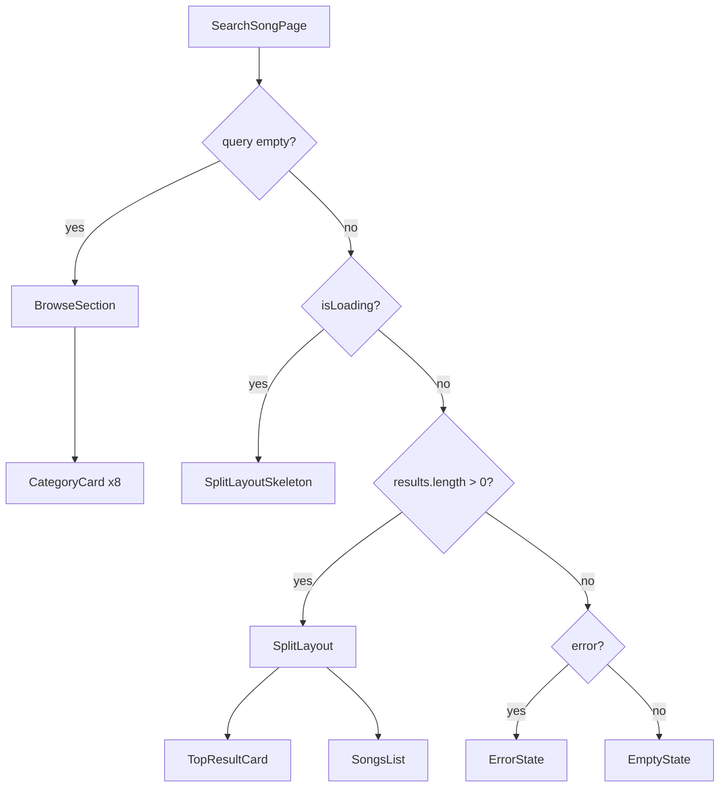

# Design Document: Search Page Spotify Redesign

## Overview

This redesign transforms `src/app/searchSong/page.tsx` from a functional-but-sparse search page into a visually rich, Spotify-inspired experience. The core change is purely presentational: the same data layer (JioSaavn API via `searchSongs`, `useDebounce`, `getSongImage`) is preserved unchanged. What changes is how that data is laid out and styled.

Two distinct UI modes exist:

- **Browse mode** (empty query): a colorful `Browse all` grid of gradient Category Cards
- **Results mode** (active query): a split layout with a prominent Top Result card on the left and a Songs List on the right

The redesign is a single-file change to `src/app/searchSong/page.tsx`, with no new routes, no new API calls, and no new hooks.

---

## Architecture

The page remains a single Next.js Client Component (`"use client"`). No server components, no new API routes, and no state management libraries are introduced.



State shape is identical to the current implementation:

| State variable   | Type             | Purpose                           |
| ---------------- | ---------------- | --------------------------------- |
| `query`          | `string`         | Controlled input value            |
| `debouncedQuery` | `string`         | Debounced value (400 ms)          |
| `results`        | `SaavnSong[]`    | Search results from JioSaavn      |
| `isLoading`      | `boolean`        | True while fetch is in-flight     |
| `error`          | `string \| null` | Error message or null             |
| `hasSearched`    | `boolean`        | True after first completed search |

---

## Components and Interfaces

All components are co-located in `src/app/searchSong/page.tsx` as local functions (no separate files needed for this scope).

### `CategoryCard`

```tsx
interface CategoryCardProps {
  genre: string;
  gradient: string; // Tailwind gradient class, e.g. "from-purple-600 to-blue-500"
  onClick: (genre: string) => void;
}
```

Renders a rounded card with a gradient background, bold white genre label, and hover scale/brightness transition. Minimum height 100px.

### `TopResultCard`

```tsx
interface TopResultCardProps {
  song: SaavnSong;
  onClick: (id: string) => void;
}
```

Large featured card (dark neutral-900 background). Displays cover image (≥80×80px), song name, primary artist, and a "Song" type badge. Clicking navigates to `/songPlay?id={song.id}`.

### `SongRow`

```tsx
interface SongRowProps {
  song: SaavnSong;
  onClick: (id: string) => void;
}
```

Compact row: 50×50px cover image, song name + artist, formatted duration. Hover changes background to neutral-800.

### `SplitLayoutSkeleton`

No props. Renders a two-column skeleton that mirrors the results layout: one large block on the left, multiple row-shaped blocks on the right. Uses the existing `Skeleton` component.

### `BrowseSection`

```tsx
interface BrowseSectionProps {
  onGenreClick: (genre: string) => void;
}
```

Renders the "Browse all" heading and the responsive grid of `CategoryCard` components.

---

## Data Models

No new data models. The existing `SaavnSong` interface from `src/services/jioSaavnApi.ts` is used throughout:

```ts
interface SaavnSong {
  id: string;
  name: string;
  album: { id: string; name: string; url: string };
  year: string;
  releaseDate: string;
  duration: number; // seconds
  label: string;
  primaryArtists: string;
  artists: { id: string; name: string; role: string; image: MediaUrl[] }[];
  image: { quality: string; link: string }[];
  downloadUrl: { quality: string; link: string }[];
}
```

### Genre → Gradient Mapping

A static constant maps each genre to a Tailwind gradient pair. This is the only new "data" introduced:

```ts
const GENRE_GRADIENTS: Record<string, string> = {
  Pop: "from-pink-500 to-rose-400",
  "Hip-Hop": "from-orange-500 to-yellow-400",
  Rock: "from-gray-600 to-slate-800",
  Electronic: "from-cyan-500 to-blue-600",
  Chill: "from-teal-500 to-emerald-400",
  Workout: "from-red-600 to-orange-500",
  Jazz: "from-amber-600 to-yellow-700",
  "R&B": "from-purple-600 to-violet-500",
};
```

### `formatDuration` utility (unchanged)

```ts
function formatDuration(seconds: number): string {
  const m = Math.floor(seconds / 60);
  const s = seconds % 60;
  return `${m}:${s.toString().padStart(2, "0")}`;
}
```

### HTML entity decoder (unchanged)

```ts
function decodeEntities(str: string): string {
  return str
    .replace(/&quot;/g, '"')
    .replace(/&#039;/g, "'")
    .replace(/&amp;/g, "&");
}
```

---

## Correctness Properties

_A property is a characteristic or behavior that should hold true across all valid executions of a system — essentially, a formal statement about what the system should do. Properties serve as the bridge between human-readable specifications and machine-verifiable correctness guarantees._

### Property 1: Browse section shown iff query is empty

_For any_ Search_Page state, the Browse_Section (genre cards + "Browse all" heading) is visible if and only if the current query string, after trimming whitespace, is empty.

**Validates: Requirements 1.1, 2.1, 7.3**

---

### Property 2: Category card click populates query

_For any_ genre label in the GENRES list, clicking its Category_Card sets the query state to exactly that genre label string.

**Validates: Requirements 1.6**

---

### Property 3: All genres have a card

_For any_ rendering of the Browse_Section, the number of Category_Cards rendered equals the number of entries in the GENRES array (≥ 8), and each card's label matches a distinct genre.

**Validates: Requirements 1.2, 1.3**

---

### Property 4: Top result card shows first result

_For any_ non-empty results array, the Top_Result_Card displays the song at index 0, and the Songs_List displays songs starting at index 1.

**Validates: Requirements 3.1, 3.5**

---

### Property 5: Song navigation round trip

_For any_ song in the results array, clicking it (either the Top_Result_Card or a row in the Songs_List) navigates to `/songPlay?id={song.id}`, where `song.id` is the exact id from the `SaavnSong` object.

**Validates: Requirements 3.7, 3.8**

---

### Property 6: Whitespace query does not trigger search

_For any_ string composed entirely of whitespace characters, setting the Search_Input to that string shall not trigger a search request and shall display the Browse_Section.

**Validates: Requirements 7.3**

---

### Property 7: Debounce delays search

_For any_ sequence of keystrokes typed within a 400 ms window, only one search request is issued — after the 400 ms debounce period elapses with no further input.

**Validates: Requirements 7.1, 7.2**

---

### Property 8: HTML entity decoding

_For any_ song name string containing HTML entities (`&quot;`, `&#039;`, `&amp;`), the rendered text must not contain the raw entity strings and must display the decoded characters instead.

**Validates: Requirements 7.5**

---

### Property 9: Empty state shows searched query

_For any_ search query that returns zero results, the empty state message rendered on screen contains the exact trimmed query string that was searched.

**Validates: Requirements 6.1**

---

### Property 10: Loading state hides results and browse section

_For any_ in-progress search, neither previous results nor the Browse_Section are visible — only the Skeleton_Loader is shown.

**Validates: Requirements 5.3**

---

## Error Handling

| Scenario                                       | Behaviour                                                                       |
| ---------------------------------------------- | ------------------------------------------------------------------------------- |
| Network/API error during search                | `error` state set; red error message displayed; results cleared                 |
| Empty results from API                         | `hasSearched = true`, `results = []`; empty state message shown with query text |
| Query cleared after error/empty                | `error` and `results` reset; Browse_Section shown                               |
| Image load failure                             | `getSongImage` falls back to `/images/music-player.png` (existing utility)      |
| Single result (only top result, no songs list) | Songs_List renders empty; Top_Result_Card still shown                           |

---

## Testing Strategy

### Unit Tests

Focus on pure functions and specific examples:

- `formatDuration(0)` → `"0:00"`
- `formatDuration(90)` → `"1:30"`
- `decodeEntities('&quot;hello&quot;')` → `'"hello"'`
- `decodeEntities('it&#039;s')` → `"it's"`
- `decodeEntities('rock &amp; roll')` → `"rock & roll"`
- Genre chip click sets query to the correct genre string (example per genre)
- Empty state renders with the correct query text embedded

### Property-Based Tests

Using **fast-check** (already compatible with the Vitest setup in this project).

Each property test runs a minimum of **100 iterations**.

Tag format: `// Feature: search-page-spotify-redesign, Property {N}: {property_text}`

| Property                      | Test description                                                                              |
| ----------------------------- | --------------------------------------------------------------------------------------------- |
| P1: Browse section visibility | Generate arbitrary strings; assert BrowseSection visible ↔ trimmed string is empty            |
| P2: Category card click       | For each genre in GENRES, simulate click, assert query === genre                              |
| P3: All genres have a card    | Render BrowseSection; assert card count === GENRES.length and labels match                    |
| P4: Top result is first       | Generate arbitrary SaavnSong arrays (length ≥ 1); assert TopResultCard id === results[0].id   |
| P5: Song navigation           | Generate arbitrary SaavnSong; simulate click; assert router.push called with correct id       |
| P6: Whitespace no-op          | Generate whitespace-only strings; assert no fetch called and BrowseSection visible            |
| P7: Debounce                  | Simulate rapid keystrokes within 400 ms; assert fetch called exactly once after delay         |
| P8: HTML entity decoding      | Generate strings with random entity insertions; assert rendered text contains no raw entities |
| P9: Empty state query text    | Generate arbitrary non-empty query strings with empty results; assert message contains query  |
| P10: Loading hides content    | Set isLoading=true; assert no results and no BrowseSection rendered                           |

Property tests P2, P3, P4, P5, P8, P9, P10 are straightforward unit-style property tests runnable with fast-check's `fc.assert(fc.property(...))`. P1, P6, P7 require a lightweight React Testing Library + fast-check integration.
